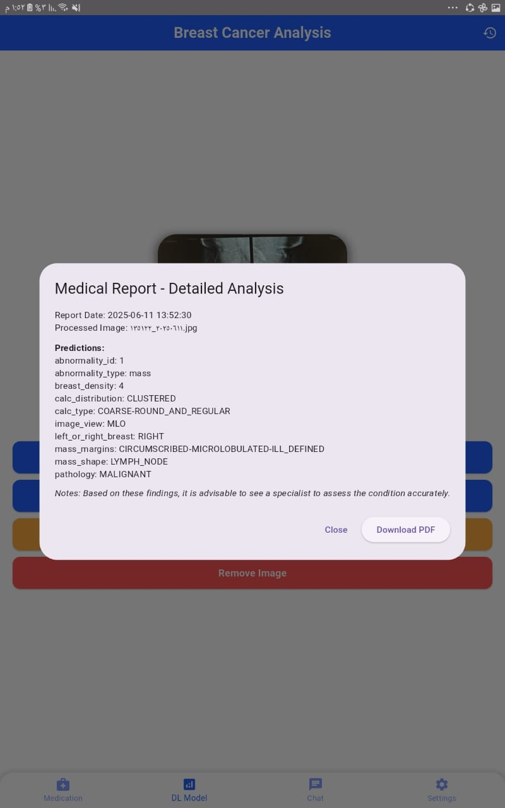
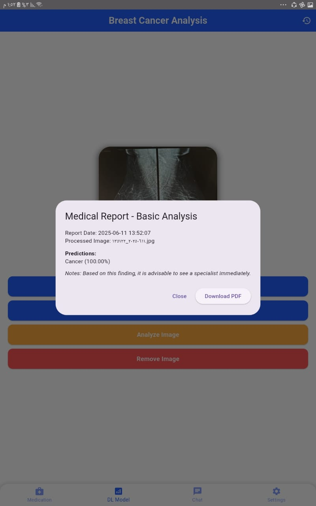
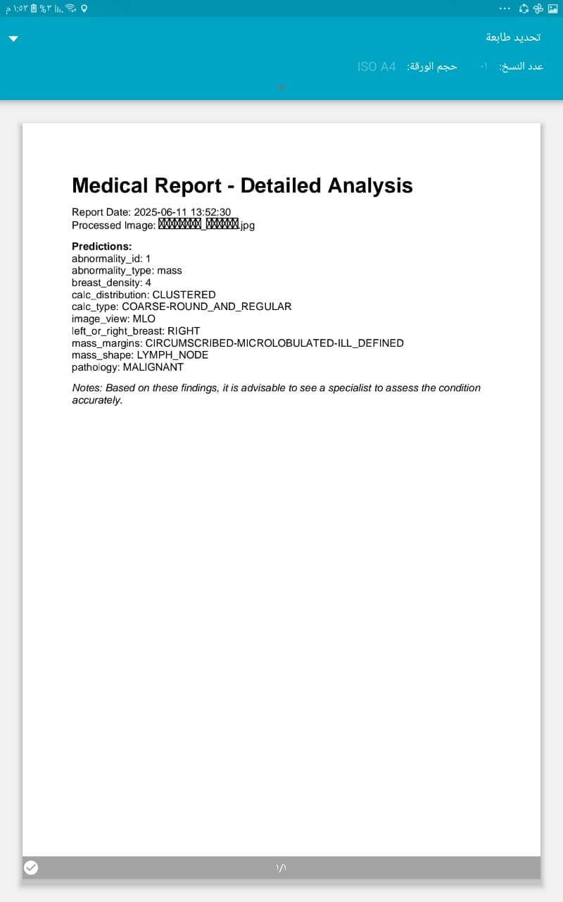

# ⬡ Breast Cancer Detection System
🩺 **Deep Learning for Early & Accurate Mammography Diagnosis**
An AI-powered system designed to detect breast cancer and generate comprehensive diagnostic predictions from mammography images.

The project includes two integrated models:  
- **Binary Classification Model** → Detects cancerous vs. non-cancerous cases  
- **Multi-Task Diagnostic Model** → Predicts 10 clinical attributes to assist radiologists with detailed interpretation  

Developed as my graduation project at the Faculty of Computers & Artificial Intelligence, Helwan University.

---

## 🚀 Key Features

### 🔍 Cancer Detection (Binary)
Identifies whether a mammogram indicates cancer or not.

### 🧠 Multi-Task Medical Diagnosis
Predicts 10 diagnostic labels including:
- Mass Shape
- Mass Margins
- Calcification Type
- Calcification Distribution
- Pathology
- Breast Density
- Breast Side
- Image View
- Abnormality ID
- Abnormality Type

### 📈 Backbone Comparison
Evaluated **ResNet50, Xception, InceptionV3, DenseNet121** —  
**Xception** outperformed all models and was selected for both stages.

### 🖼️ Detection Visualization
Includes image samples, predicted labels, and full diagnostic summaries.

### 🧹 Complete Preprocessing Pipeline
ROI extraction, filtering, enhancement, normalization, and augmentation.

---

## 📊 Model Performance

### 1️⃣ Simple Binary Classification Model

| Model       | Accuracy | Precision | Recall | F1-score | Training Speed |
|------------|----------|-----------|--------|----------|----------------|
| ResNet-50  | 0.84     | 0.42      | 0.50   | 0.46     | Fast           |
| Xception   | 0.96     | 0.95      | 0.92   | 0.93     | Moderate       |
| InceptionV3| 0.96     | 0.95      | 0.90   | 0.93     | Slow           |
| DenseNet121| 0.96     | 0.95      | 0.92   | 0.93     | Very Slow      |

**👉 Xception selected for best stability, accuracy, and training speed.**

### 2️⃣ Multi-Task Diagnostic Model (10 Outputs)
Predicts the following clinical features simultaneously:  

Mass Shape, Mass Margins, Calcification Type, Calcification Distribution, Pathology, Breast Density, Left/Right Breast, Image View (CC/MLO), Abnormality ID, Abnormality Type  

**➡️ Xception achieved the highest accuracy across all output heads and was chosen as the final diagnostic model.**

---

## 🖼️ Detection Output Samples

  

  

  

---

## 🧰 Tech Stack

| Component              | Technology                        |
|-----------------------|----------------------------------|
| Deep Learning          | TensorFlow, Keras                |
| Backbone Architectures | Xception, ResNet50, InceptionV3, DenseNet121 |
| Image Processing       | OpenCV, NumPy                     |
| Visualization          | Matplotlib, Seaborn               |
| Development Environment| Python, Jupyter Notebook          |

---
## 📱 Flutter Mobile Application

The Breast Cancer Detection System includes a **Flutter-based mobile app** that allows patients to interact with the AI models and manage their health data conveniently. The app communicates with a **Flask-based backend API** that serves the trained deep learning models for real-time predictions.

---

### a) Log In
Secure access is provided through username-password authentication. Only authorized users can access the system.  
- **Input:** Email, Password  
- **Output:** Invalid login or successful login  

### b) Sign Up
New users can create an account to use the system.  
- **Input:** Name, Email Address, Phone Number, Password  
- **Output:** Successfully Registered  

### c) AI Cancer Detection (Detailed Model)
Patients can upload or capture mammogram/breast tissue images. The AI analyzes abnormalities and provides a **detailed diagnostic report**.  
- **Input:** Mammogram or breast tissue scan (uploaded or captured)  
- **Output:** Detailed report with detected abnormalities  

### d) AI Cancer Detection (Simple Model)
The AI model checks whether the uploaded scan shows cancer or not and provides a confidence percentage.  
- **Input:** Mammogram or breast tissue scan (uploaded or captured)  
- **Output:** Cancer/Non-Cancer, Confidence score (e.g., 95% sure it’s Cancer)  

### e) Save AI Result
Patients can save AI detection results as a **PDF report**.  
- **Input:** AI Detection Page (uploaded), Result  
- **Output:** Detailed report generated and downloadable as PDF  

### f) History
Users can view and manage their **previous reports**, including deletion of unwanted reports.  
- **Input:** User action (view or delete)  
- **Output:** List of previous reports or confirmation of deletion  

### g) Medicine Alarm
Helps patients manage medication schedules efficiently with notifications.  
- **Input:** Medication name, alert time, frequency (daily/weekly), modifications or cancellations  
- **Output:** Timely notifications, updated schedule, or canceled alerts  

### h) AI-Powered Chatbot Assistant
An AI chatbot assists users by answering health-related questions.  
- **Input:** User message or question (via chat)  
- **Output:** AI-generated response based on the query  

### i) Settings
Users can customize app experience: adjust **font size** or toggle **dark mode**.  
- **Input:** User action (modify font size, toggle dark mode)  
- **Output:** Updated font size or theme applied  

---

## ⚙️ Backend Integration (Flask API)

The mobile app communicates with a **Flask RESTful API** that exposes trained AI models for real-time prediction.

### 1️⃣ Simple Prediction Endpoint
- Accepts an image file via POST  
- Preprocesses the image to match model input requirements  
- Predicts Cancer/Non-Cancer  
- Returns the predicted class and confidence score  

### 2️⃣ Detailed Prediction Endpoint
- Predicts multiple attributes: mass shape, calcification type, breast density, pathology, etc.  
- Returns a structured diagnostic report including timestamp and advisory notes  

### 3️⃣ Image Preprocessing
- Resize images to required dimensions (e.g., 100×100 or 224×224)  
- Normalize pixel values to `[0, 1]`  
- Add batch dimension for correct model input  

### 4️⃣ Decoding Model Output
- Converts numeric predictions into readable labels using dataset columns  
- Maps predicted index to the corresponding label for display in the app  

---

**This integration allows patients to receive AI-powered breast cancer diagnostics on their mobile devices, complete with detailed reports and a user-friendly interface.**

### 👩‍💻 Developed by [Rwan Ezzat](https://www.linkedin.com/in/rwan-ezzat-87128827a/) 
