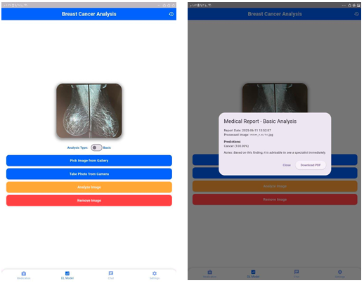
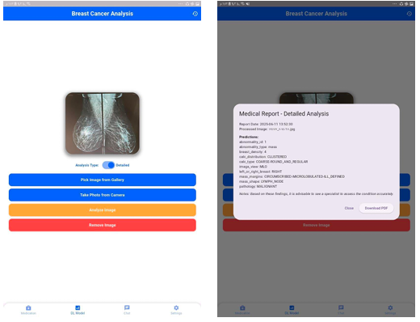

# ⬡ Breast Cancer Detection System
🩺 **Deep Learning for Early & Accurate Mammography Diagnosis**
An AI-powered system designed to detect breast cancer and generate comprehensive diagnostic predictions from mammography images.

The project includes two integrated models:  
- **Binary Classification Model** → Detects cancerous vs. non-cancerous cases  
- **Multi-Task Diagnostic Model** → Predicts 10 clinical attributes to assist radiologists with detailed interpretation  

Developed as my graduation project at the Faculty of Computers & Artificial Intelligence, Helwan University.

---

## 🚀 Key Features

### 🔍 Cancer Detection (Binary)
Identifies whether a mammogram indicates cancer or not.

### 🧠 Multi-Task Medical Diagnosis
Predicts 10 diagnostic labels including:
- Mass Shape
- Mass Margins
- Calcification Type
- Calcification Distribution
- Pathology
- Breast Density
- Breast Side
- Image View
- Abnormality ID
- Abnormality Type

### 📈 Backbone Comparison
Evaluated **ResNet50, Xception, InceptionV3, DenseNet121** —  
**Xception** outperformed all models and was selected for both stages.

### 🖼️ Detection Visualization
Includes image samples, predicted labels, and full diagnostic summaries.

### 🧹 Complete Preprocessing Pipeline
ROI extraction, filtering, enhancement, normalization, and augmentation.

---

## 📊 Model Performance

### 1️⃣ Simple Binary Classification Model

| Model       | Accuracy | Precision | Recall | F1-score | Training Speed |
|------------|----------|-----------|--------|----------|----------------|
| ResNet-50  | 0.84     | 0.42      | 0.50   | 0.46     | Fast           |
| Xception   | 0.96     | 0.95      | 0.92   | 0.93     | Moderate       |
| InceptionV3| 0.96     | 0.95      | 0.90   | 0.93     | Slow           |
| DenseNet121| 0.96     | 0.95      | 0.92   | 0.93     | Very Slow      |

**👉 Xception selected for best stability, accuracy, and training speed.**

### 2️⃣ Multi-Task Diagnostic Model (10 Outputs)
Predicts the following clinical features simultaneously:  

Mass Shape, Mass Margins, Calcification Type, Calcification Distribution, Pathology, Breast Density, Left/Right Breast, Image View (CC/MLO), Abnormality ID, Abnormality Type  

**➡️ Xception achieved the highest accuracy across all output heads and was chosen as the final diagnostic model.**

---

## 🖼️ Detection Output Samples

  

  

  

---

## 🧰 Tech Stack

| Component              | Technology                        |
|-----------------------|----------------------------------|
| Deep Learning          | TensorFlow, Keras                |
| Backbone Architectures | Xception, ResNet50, InceptionV3, DenseNet121 |
| Image Processing       | OpenCV, NumPy                     |
| Visualization          | Matplotlib, Seaborn               |
| Development Environment| Python, Jupyter Notebook          |

---

## 📂 Folder Structure

